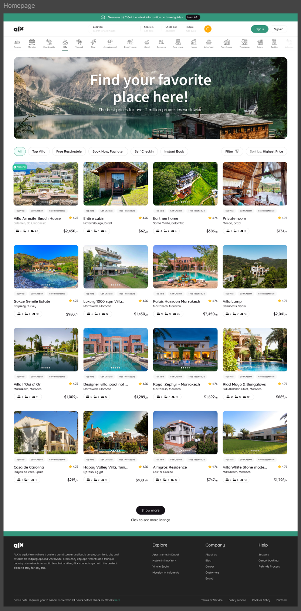
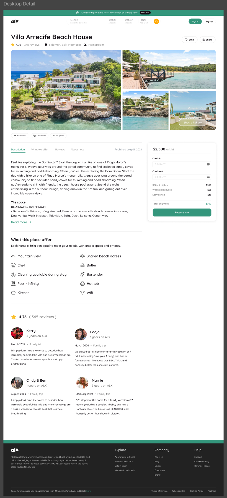
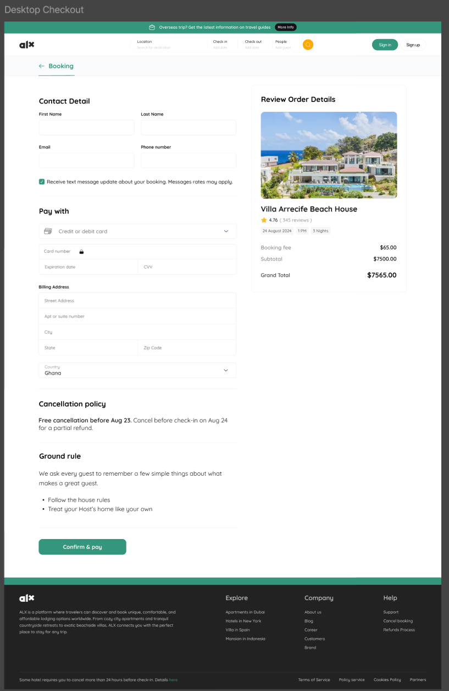

# AirBnB Clone - Booking Management System

A simple booking and management system using AirBnB as a case study. This system will have a simple but lovely UI/UX that allows users to perform basic functionalities.

## Project Goals

At the end of this program, I will have developed adequate knowledge and skills to implement any type of system. I will:

- Understand the project scope.
- Identify key features to be implemented.
- Adhere to designated timelines and milestones.
- Utilize the necessary tools and technologies.
- Fulfill my roles and responsibilities within the project.

## Tech Stack

- <strong>Frontend</strong>: React with TypeScript, Next.js for server-side rendering and static site generation, TailwindCSS for styling.

- <strong>Backend</strong>: Python, Django, and MySQL (the backend is not the primary focus).

- <strong>Other Tools</strong>: Redux or Context API for state management, REST for API integration and Jest for testing.

## UI/UX Design Planning

A user-friendly design is important in a booking system in order to help users easily navigate the interface and perform basic functionalities.

The design goals for this project are as follows:

### Features

The key features to be implemented include:

- <strong>Property Listings</strong>: Display properties with relevant details and images.

- <strong>Booking System</strong>: Allow users to book properties, view booking details, and manage bookings.

- <strong>Search Functionality</strong>: Enable users to search for properties based on various criteria (location, price, availability).
- <strong>User Authentication</strong>: Secure login and registration for users.

### Primary Pages

| Page                    | Description                                                                                                                                                                                                                                                                           | Image                                    |
| ----------------------- | ------------------------------------------------------------------------------------------------------------------------------------------------------------------------------------------------------------------------------------------------------------------------------------- | ---------------------------------------- |
| <strong>Page 1</strong> | This will be the main interface of the AirBnB clone. It shows a clean and modern layout with various property listings displayed, each with a title, price and a brief description. The design focuses on user-friendly navigation and visual appeal.                                 |  |
| <strong>Page 2</strong> | This page illustrates a detailed view of a specific property listing within the AirBnB clone. It highlights key features such as the property’s name, location, price, and additional details like amenities. The interface emphasizes clarity and ease of use for potential renters. |  |
| <strong>Page 3</strong> | This page showcases the booking or reservation process for the selected property in the AirBnB clone. It may include options for selecting dates, the number of guests, and finalizing the booking. The design is streamlined to ensure a smooth user experience.                     |  |

### Design Properties

Identifying design properties of a mockup design is important because it helps make the design consistent and also ensures the finished product doesn't drift from the mockup design.

#### Colors

- Primary colors: #34967C
- Secondary colors: #161117, #BEBEBE, #FFA800,
- Other colors: #FAC02B, #262626, #F0FFFB, #8C8C8C, #F9F9F9, #131212, #FFFFFF, #000000, #CACACA, #222222, #616161, #F3F0F0, #6C6C6C, #929292, #747474, #8F8F8F, #F8FAFC
- Border colors: #E9E9E9, #ECECEC, #EAEAEA, #E7E6E6

#### Typography

- Font Family : Quicksand, Souce Sans Pro, SF Pro Display
- Font Weights: 400, 500, 600, 700
- Font Sizes: 12px, 13px, 14px, 16px, 17px, 19px, 20px, 22px, 23px, 24px, 25px, 27px, 31px, 94px
